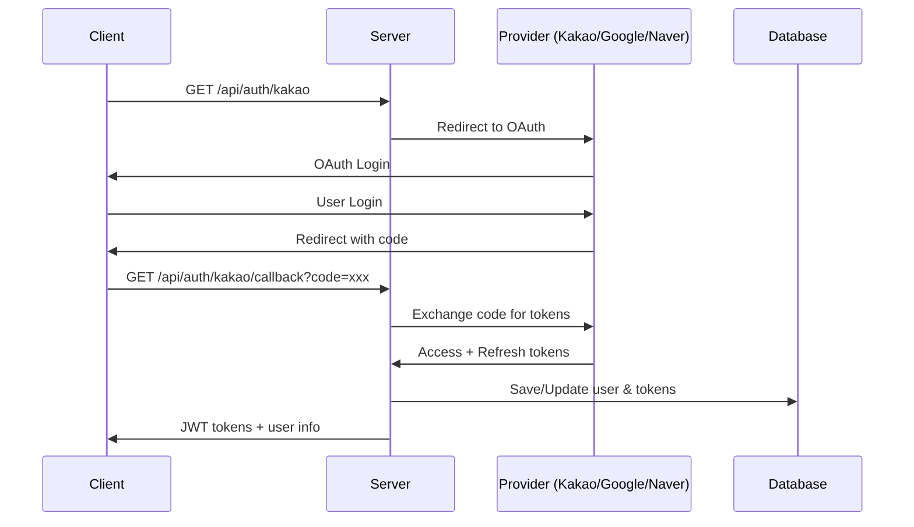
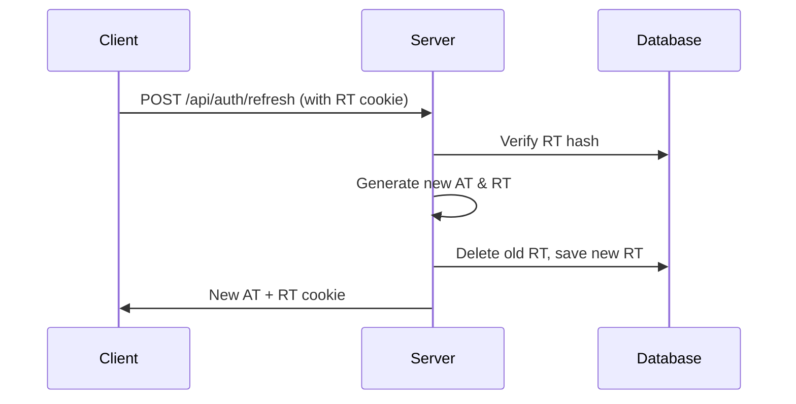
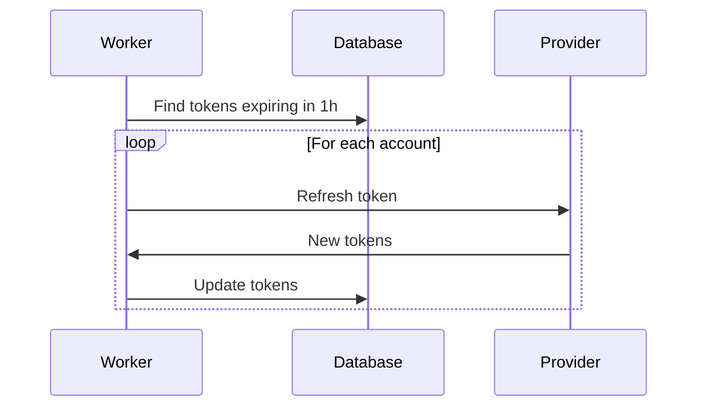

# 🔐 소셜 로그인 + 토큰 관리 시스템

Node.js (Express) + PostgreSQL 백엔드에 카카오·구글·네이버 소셜 로그인과 RS256 JWT 토큰 관리 시스템을 도입했습니다.

## 🚀 주요 기능

### ✅ 완료된 기능
- [x] **OAuth 2.0 / OIDC 소셜 로그인**
  - 카카오 로그인
  - 구글 로그인  
  - 네이버 로그인
- [x] **RS256 JWT 토큰 시스템**
  - 액세스 토큰 (15분 만료)
  - 리프레시 토큰 (14일 만료, 회전 방식)
- [x] **토큰 보안**
  - 외부 토큰 암호화 저장 (bcrypt)
  - 액세스 토큰 블랙리스트
  - 리프레시 토큰 해시 저장
- [x] **자동 토큰 갱신**
  - 6시간마다 만료 임박 토큰 갱신
  - 만료된 토큰 자동 정리
- [x] **인증 미들웨어**
  - Bearer 토큰 검증
  - 블랙리스트 확인
  - 사용자 존재 확인

## 📁 프로젝트 구조

```
backend/
├── src/
│   ├── auth/
│   │   └── providers.ts          # Passport OAuth 전략
│   ├── controllers/
│   │   └── AuthController.ts     # 인증 컨트롤러
│   ├── lib/
│   │   └── jwt.ts               # JWT 유틸리티
│   ├── middlewares/
│   │   └── auth.ts              # 인증 미들웨어
│   ├── routes/
│   │   └── authRoutes.ts        # 인증 라우터
│   ├── jobs/
│   │   └── providerTokenRefresh.ts # 토큰 갱신 워커
│   └── types/
│       └── passport.d.ts        # Passport 타입 정의
├── keys/
│   ├── jwt_private.pem          # JWT 개인키
│   └── jwt_public.pem           # JWT 공개키
├── prisma/
│   └── schema.prisma            # DB 스키마 (인증 테이블 추가)
└── postman/
    └── Auth_API_Tests.postman_collection.json # API 테스트
```

## 🗄️ 데이터베이스 스키마

### 새로 추가된 테이블

```sql
-- 사용자 테이블 (기존 수정)
CREATE TABLE users (
  id           SERIAL PRIMARY KEY,
  nickname     VARCHAR(40) NOT NULL,
  created_at   TIMESTAMPTZ DEFAULT now(),
  deleted_at   TIMESTAMPTZ
);

-- 소셜 계정 테이블
CREATE TABLE social_accounts (
  id             SERIAL PRIMARY KEY,
  user_id        INTEGER NOT NULL REFERENCES users(id) ON DELETE CASCADE,
  provider       VARCHAR(10) CHECK (provider IN ('KAKAO','GOOGLE','NAVER')),
  provider_uid   TEXT NOT NULL,
  access_token   TEXT,           -- 암호화된 액세스 토큰
  refresh_token  TEXT,           -- 암호화된 리프레시 토큰
  expires_at     TIMESTAMPTZ,
  UNIQUE (provider, provider_uid)
);

-- 리프레시 토큰 테이블 (단일 사용)
CREATE TABLE refresh_tokens (
  id           SERIAL PRIMARY KEY,
  user_id      INTEGER NOT NULL REFERENCES users(id) ON DELETE CASCADE,
  token_hash   TEXT NOT NULL UNIQUE,  -- bcrypt 해시
  expires_at   TIMESTAMPTZ NOT NULL,
  created_at   TIMESTAMPTZ DEFAULT now()
);

-- 액세스 토큰 블랙리스트
CREATE TABLE access_token_blacklist (
  jti          TEXT PRIMARY KEY,      -- JWT ID
  expires_at   TIMESTAMPTZ NOT NULL
);
```

## 🔧 설정

### 1. 환경 변수 (.env)

```ini
# JWT 설정
JWT_PRIVATE_KEY_PATH=./keys/jwt_private.pem
JWT_PUBLIC_KEY_PATH=./keys/jwt_public.pem
JWT_ACCESS_EXPIRES=15m
JWT_REFRESH_EXPIRES=14d

# OAuth 설정
KAKAO_CLIENT_ID=your_kakao_client_id
KAKAO_CLIENT_SECRET=your_kakao_client_secret
GOOGLE_CLIENT_ID=your_google_client_id
GOOGLE_CLIENT_SECRET=your_google_client_secret
NAVER_CLIENT_ID=your_naver_client_id
NAVER_CLIENT_SECRET=your_naver_client_secret
OAUTH_REDIRECT_URI=https://your-api.com/auth/callback
```

### 2. JWT 키 생성

```bash
# 개인키 생성
openssl genrsa -out keys/jwt_private.pem 2048

# 공개키 생성
openssl rsa -in keys/jwt_private.pem -pubout -out keys/jwt_public.pem
```

### 3. 의존성 설치

```bash
pnpm add passport passport-kakao passport-google-oauth20 passport-naver
pnpm add jose bcryptjs uuid node-cron cookie-parser
pnpm add @types/passport @types/bcryptjs @types/cookie-parser -D
```

## 🛣️ API 엔드포인트

### 인증 관련 API

| 메서드 | 엔드포인트 | 설명 |
|--------|------------|------|
| GET | `/api/auth/:provider` | 소셜 로그인 시작 |
| GET | `/api/auth/:provider/callback` | 소셜 로그인 콜백 |
| POST | `/api/auth/refresh` | 토큰 갱신 |
| POST | `/api/auth/logout` | 로그아웃 |
| GET | `/api/auth/profile` | 프로필 조회 |
| DELETE | `/api/auth/account` | 계정 탈퇴 |

### 지원하는 소셜 로그인
- `:provider` = `kakao`, `google`, `naver`

## 🔄 워크플로우

### 1. 소셜 로그인 플로우



### 2. 토큰 갱신 플로우



### 3. 자동 토큰 갱신 워커



## 🧪 테스트

### Postman 컬렉션 사용

1. `postman/Auth_API_Tests.postman_collection.json` 파일을 Postman에 import
2. 환경 변수 설정:
   - `baseUrl`: `http://localhost:3350`
   - `accessToken`: (로그인 후 자동 설정)
   - `refreshToken`: (로그인 후 자동 설정)

### 테스트 시나리오

1. **Health Check**: 서버 상태 확인
2. **소셜 로그인**: 브라우저에서 OAuth 플로우 실행
3. **토큰 갱신**: 리프레시 토큰으로 새 액세스 토큰 발급
4. **프로필 조회**: 인증된 사용자 정보 조회
5. **보호된 API**: 인증이 필요한 API 호출
6. **로그아웃**: 세션 종료 및 토큰 무효화

## 🔒 보안 고려사항

### ✅ 구현된 보안 기능
- **RS256 JWT**: 비대칭 키로 서명
- **토큰 암호화**: 외부 토큰 bcrypt 해시 저장
- **토큰 회전**: 리프레시 토큰 사용 시 새 토큰 발급
- **블랙리스트**: 로그아웃된 액세스 토큰 무효화
- **자동 정리**: 만료된 토큰 자동 삭제

### ⚠️ 주의사항
- **개인키 보안**: `keys/jwt_private.pem`은 절대 Git에 커밋하지 마세요
- **환경 변수**: OAuth 클라이언트 시크릿은 안전하게 관리
- **HTTPS**: 프로덕션에서는 반드시 HTTPS 사용
- **토큰 만료**: 적절한 만료 시간 설정

## 🚀 배포 시 고려사항

### 1. 환경별 설정
```bash
# 개발 환경
NODE_ENV=development
OAUTH_REDIRECT_URI=http://localhost:3350/auth/callback

# 프로덕션 환경  
NODE_ENV=production
OAUTH_REDIRECT_URI=https://your-domain.com/auth/callback
```

### 2. 키 관리
- **개발**: 로컬 파일 시스템
- **프로덕션**: AWS KMS, Azure Key Vault, GCP Secret Manager 등 사용

### 3. 데이터베이스
- **마이그레이션**: `npx prisma migrate deploy`
- **백업**: 정기적인 DB 백업 설정

## 📊 모니터링

### 로그 확인
```bash
# 토큰 갱신 워커 로그
grep "토큰 갱신" logs/app.log

# 인증 관련 로그
grep "로그인\|로그아웃" logs/app.log
```

### 메트릭
- 소셜 로그인 성공/실패율
- 토큰 갱신 성공률
- API 응답 시간
- 에러 발생 빈도

## 🔧 문제 해결

### 일반적인 문제들

1. **토큰 검증 실패**
   - JWT 키 파일 경로 확인
   - 토큰 만료 시간 확인
   - 블랙리스트 확인

2. **소셜 로그인 실패**
   - OAuth 클라이언트 설정 확인
   - 리다이렉트 URI 설정 확인
   - 네트워크 연결 확인

3. **토큰 갱신 실패**
   - 리프레시 토큰 만료 확인
   - 소셜 제공자 API 상태 확인
   - DB 연결 확인

### 디버깅 명령어
```bash
# 서버 상태 확인
curl http://localhost:3350/health

# JWT 키 확인
ls -la keys/

# DB 연결 확인
npx prisma db push

# 로그 확인
tail -f logs/app.log
```

## 📝 TODO

### 향후 개선 사항
- [ ] 이메일 인증 추가
- [ ] 2FA (2단계 인증) 지원
- [ ] 소셜 계정 연결/해제 기능
- [ ] 사용자 권한 관리 (RBAC)
- [ ] API 사용량 제한
- [ ] 감사 로그 (Audit Log)
- [ ] 실시간 알림 (WebSocket)

---

**🎉 소셜 로그인 + 토큰 관리 시스템이 성공적으로 도입되었습니다!** 